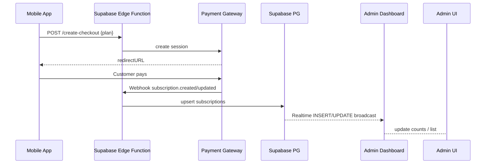

# Payment & Subscription Integration

## Overview
Add subscription-based paywall to Pitara mobile & admin ecosystem using Stripe (default) or Razorpay (India-specific). Provides secure checkout, renewals, webhook-driven DB updates, and real-time dashboards via Supabase Realtime.

## Components
1. **Payment Gateway** – Stripe Checkout / Razorpay Subscriptions.
2. **Backend Service** – Supabase Edge Function `payments` (or Node micro-service) to create checkout sessions, verify signature, and write `subscriptions` table.
3. **Database Schema**
   * `subscriptions` (`id`, `user_id`, `gateway`, `subscription_id`, `status`, `start_at`, `end_at`, `plan_id`, `raw`) – realtime enabled.
   * `plans` (`id`, `name`, `price`, `period_days`, `stripe_price_id`/`razorpay_plan_id`).
4. **Admin Dashboard** – subscribes to Supabase channel on `subscriptions` for INSERT/UPDATE to reflect new subscribers instantly.
5. **Mobile Paywall Screen** – checks `subscriptions.status` via RPC `check_active_subscription`. If inactive, shows pricing + subscribe button that calls backend to get gateway checkout link.

## Flow

## Paywall Logic (Mobile)
1. On `EpisodeScreen` mount, call `hasActiveSubscription()`.
2. If false, navigate to `PaywallScreen`.
3. Paywall shows:
   * Poster / teaser
   * Plan options (single tier for MVP)
   * Benefits list
   * Subscribe button
4. Subscribe → call `/create-checkout`, open browser/Stripe Sheet.
5. After payment success, deep-link back, refresh `hasActiveSubscription()`.

## Supabase Edge Functions
* `payments/create-checkout`
  * Input: `plan_id`, `user_token`
  * Output: `checkout_url`
* `payments/webhook`
  * Verify signature
  * Map event types: `checkout.session.completed`, `invoice.paid`, `customer.subscription.deleted`
  * Update `subscriptions` rows and `users.is_premium` optional flag.

## Security & Testing
* Use server-side verification only; never trust mobile receipt.
* Hidden API keys via Supabase secrets.
* E2E tests simulating webhook payloads.

_Last updated: 2025-06-20_ 